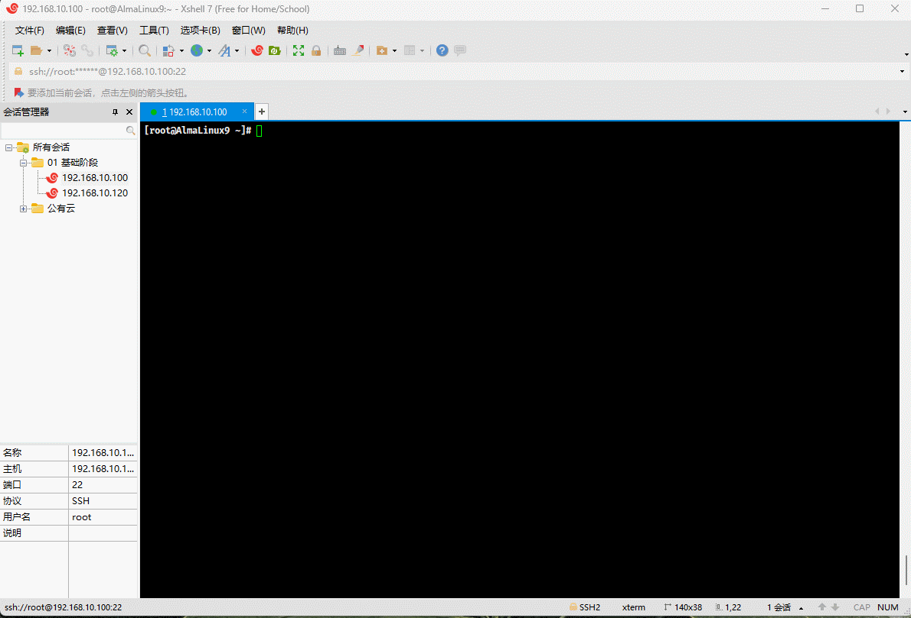

# Chapter 1: Introduction

## 1.1 Overview

* Starting from version v0.3.0, r-nacos supports cluster deployment. The primary goal of cluster deployment is to enable horizontal scaling of services through multi-instance deployment, ensuring service continuity even if some nodes fail, thereby enhancing overall stability.

## 1.2 Configuration Center

* For the `Configuration Center`, r-nacos uses the raft cluster protocol combined with local storage to persist data, **eliminating the need to rely on MySQL for configuration storage**. Its persistence mechanism is similar to that of `etcd`:

| Request Method | Description                                                     | Performance                                          |
| :------------- | :------------------------------------------------------------- | :-------------------------------------------------- |
| Write          | Only the master node can perform write operations; other nodes forward write requests to the master node | The cluster achieves around 2000 tps, with potential for further optimization. |
| Read           | Each node can read the complete dataset                         | A single node can handle around 80,000 qps, with the total cluster capacity being n*80,000. |

> [!IMPORTANT]
>
> TPS (Transactions Per Second) and QPS (Queries Per Second) are both metrics used to evaluate system performance, but they focus on different aspects.
>
> * **TPS (Transactions Per Second)**:
>   - TPS measures the number of transactions a server can complete per second.
>   - A transaction typically represents a complete operation, such as a client sending a request to the server and receiving a response.
>   - TPS emphasizes the overall performance of the system, including its processing power, response time, and ability to handle concurrent operations.
>   - The TPS value reflects the system's overall throughput, indicating how much work it can handle in a given time frame.
> * **QPS (Queries Per Second)**:
>   - QPS measures the number of queries a server can respond to per second.
>   - QPS is more concerned with the performance of databases or storage systems, particularly in handling read operations (queries).
>   - A single page visit might only count as one TPS, but it could generate multiple server requests, all of which contribute to the QPS.
>   - A high QPS value indicates that the system can quickly respond to query requests and has efficient read capabilities.
>
> In summary, TPS focuses on the system's ability to handle complete transactions, while QPS focuses on the efficiency of handling individual query requests. In practice, improving TPS may involve techniques like concurrent programming, cache optimization, database tuning, and load balancing, whereas improving QPS often centers on optimizing database query performance.

## 1.3 Registry Center

* In the `Registry Center`, r-nacos uses a protocol similar to distor to synchronize data across clusters. The Registry Center shares the node list information with the Configuration Center, but the two protocols are implemented independently.

| Request Method | Description                                                  | Performance                                   |
| :------------- | :----------------------------------------------------------- | :------------------------------------------- |
| Write          | Each node in the Registry Center is equal, with responsibilities divided by hash. A node can write to the services it manages; otherwise, it forwards the request to the appropriate node. | Cluster performance is around 10,000 tps.    |
| Read           | Every node can access the complete data set.                 | Single node performance is around 30,000 qps. Total cluster capacity is n*30,000. |

# Chapter 2: Cluster Deployment

## 2.1 Overview

* Cluster deployment is similar to single-node deployment, with the main difference being the runtime parameters and the addition of cluster node configurations.

## 2.2 Cluster Rules Explanation

* There are four key configuration parameters for cluster deployment:

| Cluster-related Configuration Parameters | Description                                                  | Default Value | Explanation                                                  |
| ---------------------------------------- | ------------------------------------------------------------ | ------------- | ------------------------------------------------------------ |
| RNACOS_RAFT_NODE_ID                      | Node ID                                                      | 1             | Not required for single-node operation.                      |
| RNACOS_RAFT_NODE_ADDR                    | Node address IP:GrpcPort                                     | 127.0.0.1:9848 | Effective at every startup for single-node operation;<br>For multi-node clusters, only the value set at cluster join is used. |
| RNACOS_RAFT_AUTO_INIT                    | Whether to initialize as the master node (effective only at first startup) | true          | Defaults to true for node 1.<br>Defaults to false for other nodes. |
| RNACOS_RAFT_JOIN_ADDR                    | Whether to join the corresponding master node (effective only at first startup) | Empty         | 127.0.0.1:9848                                               |

> [!NOTE]
>
> Detailed parameter explanations are available [here](../../env_config/).

* Cluster configuration rules:
  * ① All `cluster nodes` must have `RNACOS_RAFT_NODE_ID` and `RNACOS_RAFT_NODE_ADDR` set. Each node must have a unique `node_id` and `node_addr`, where `node_id` is a `positive integer` and `node_addr` is `ip:grpc_port`.
  * ② For the `master` node, set `RNACOS_RAFT_AUTO_INIT` to `true` initially (default for node 1, no additional setup needed).
  * ③ For `slave` nodes, set `RNACOS_RAFT_AUTO_INIT` to `false` initially (default for nodes other than 1, no additional setup needed). Also, set `RNACOS_RAFT_JOIN_ADDR` to the address of the current `master` node to facilitate automatic cluster joining at startup.
  * ④ Steps ② and ③ are only for initial cluster setup. Once the cluster is operational, subsequent configurations are loaded from the raft database.
  * ⑤ The number of nodes in the cluster is flexible; it can be 1, 2, 3, 4, etc. However, the raft protocol only supports write operations if fewer than half of the nodes are down (queries are unaffected). For example, a 3-node cluster can tolerate one node failure, and a 2-node cluster operates normally but cannot handle node failures.
  * ⑥ `Slave nodes` can be added as needed during operation. For instance, a cluster might start with 3 nodes and later expand by adding 2 more.

## 2.3 Cluster Planning

* To avoid port conflicts on the same host, the `bridge` network of Docker Compose is utilized, as shown below:


## 2.4 Docker Compose Execution

* Create the docker-compose.yaml file:

```shell
vim docker-compose.yaml
```

```yaml
version: '3.8' # Specify the version number

services: # All services to be launched
  r-nacos-master: # Master node
    image: qingpan/rnacos:stable
    container_name: r-nacos-master
    environment: # Environment variables
      - RUST_LOG=warn
      - RNACOS_HTTP_PORT=8848
      - RNACOS_RAFT_NODE_ADDR=r-nacos-master:9848
      - RNACOS_CONFIG_DB_DIR=db
      - RNACOS_RAFT_NODE_ID=1
      - RNACOS_RAFT_AUTO_INIT=true
      - TZ=Asia/Shanghai
    volumes:
      - /var/nacos/io1:/io:rw
      - /etc/localtime:/etc/localtime:ro
    ports: # Host and container port mapping
      - "8848:8848" # Left host port: Right container port
      - "9848:9848" # Left host port: Right container port
      - "10848:10848" # Left host port: Right container port
    networks: # Configure the network the container connects to, referencing the top-level networks entry
      - rnacos
    restart: always
  r-nacos-slave1: # Slave node
    image: qingpan/rnacos:stable
    container_name: r-nacos-slave1
    environment: # Environment variables
      - RUST_LOG=warn
      - RNACOS_HTTP_PORT=8848
      - RNACOS_RAFT_NODE_ADDR=r-nacos-slave1:9848
      - RNACOS_CONFIG_DB_DIR=db
      - RNACOS_RAFT_NODE_ID=2
      - RNACOS_RAFT_JOIN_ADDR=r-nacos-master:9848
      - TZ=Asia/Shanghai
    volumes:
      - /var/nacos/io2:/io:rw
      - /etc/localtime:/etc/localtime:ro  
    networks: 
      - rnacos
    restart: always
    depends_on:
      - r-nacos-master
  r-nacos-slave2: # Slave node
    image: qingpan/rnacos:stable
    container_name: r-nacos-slave2
    environment: # Environment variables
      - RUST_LOG=warn
      - RNACOS_HTTP_PORT=8848
      - RNACOS_RAFT_NODE_ADDR=r-nacos-slave2:9848
      - RNACOS_CONFIG_DB_DIR=db
      - RNACOS_RAFT_NODE_ID=3
      - RNACOS_RAFT_JOIN_ADDR=r-nacos-master:9848
      - TZ=Asia/Shanghai
    volumes:
      - /var/nacos/io3:/io:rw
      - /etc/localtime:/etc/localtime:ro  
    networks: 
      - rnacos
    restart: always
    depends_on:
      - r-nacos-master 
      - r-nacos-slave1
```

# Define networks, multiple can be defined. If not declared, a default network named "projectname_default" bridge network will be created.
networks:
  rnacos: # The name of a specific network entry
    name: rnacos # Network name, default is "projectname_networkentryname"
    driver: bridge # Network mode, default is bridge
```



* Run Docker Compose:

```shell
docker compose up -d
```


* Check if it runs successfully:

```shell
docker compose ps
```


* Access via browser (address is `http://192.168.10.100:10848/`):


## 2.5 Deploying Without Docker

### 2.5.1 Overview

* The deployment method is similar to [Software Package Single Machine Deployment](../linux_deploy/), except that r-nacos supports starting via environment variables or configuration files. The corresponding documentation is [here]().

### 2.5.2 Cluster Planning

* Use three Linux hosts as nodes for r-nacos, namely:


* Assume the configuration information of the three Linux hosts is as follows:

| Linux Host     | IP Address      | Description |
| -------------- | --------------- | ----------- |
| r-nacos-master | 192.168.10.100  | Master Node |
| r-nacos-slave1 | 192.168.10.101  | Slave Node  |
| r-nacos-slave2 | 192.168.10.102  | Slave Node  |

> [!IMPORTANT]
>
> * ① Ensure that the three Linux hosts can communicate with each other.
> * ② In the test environment, you can choose to turn off the firewall!!!

### 2.5.3 Cluster Deployment

#### 2.5.3.1 Configuration Information for Each Node

* The configuration information of `env01` for `r-nacos-master` is as follows:

```txt
#file:env01 , Initialize with the leader node role
RUST_LOG=warn
RNACOS_HTTP_PORT=8848
RNACOS_RAFT_NODE_ADDR=127.0.0.1:9848
RNACOS_CONFIG_DB_DIR=db01
RNACOS_RAFT_NODE_ID=1
RNACOS_RAFT_AUTO_INIT=true
```

* The configuration information of `env02` for `r-nacos-slave1` is as follows:

```txt
#file:env02 , Initialize with the follower node role
RUST_LOG=warn
RNACOS_HTTP_PORT=8849
RNACOS_RAFT_NODE_ADDR=127.0.0.1:9849
RNACOS_CONFIG_DB_DIR=db02
RNACOS_RAFT_NODE_ID=2
RNACOS_RAFT_JOIN_ADDR=127.0.0.1:9848
```

* The configuration information of `env03` for `r-nacos-slave2` is as follows:

```shell
#file:env03 , Initialize with the follower node role
RUST_LOG=warn
RNACOS_HTTP_PORT=8850
RNACOS_RAFT_NODE_ADDR=127.0.0.1:9850
RNACOS_CONFIG_DB_DIR=db03
RNACOS_RAFT_NODE_ID=3
RNACOS_RAFT_JOIN_ADDR=127.0.0.1:9848
```


#### 2.5.3.2 Starting the Cluster

* Begin by starting each node in order, starting with the master node:

```shell
nohup ./rnacos -e env01 > rnacos.log 2>&1 &
```

* Next, start the slave nodes and have them join the cluster:

```shell
nohup ./rnacos -e env02 > rnacos.log 2>&1 &
```

```shell
nohup ./rnacos -e env03 > rnacos.log 2>&1 &
```

## 2.6 Cluster Restart

### 2.6.1 Overview

* If the cluster is set up using Docker Compose, restarting is straightforward. You can use either of the following commands:

```shell
# This command will remove the containers and then restart them; if no mounts are used, data will be lost.
docker compose down && docker compose up -d
```

```shell
# Stop and restart all services without removing the containers
docker compose restart
```

* If the cluster is built using software packages, the restart process is identical to the initial startup: omitted.

### 2.6.2 Notes

* Once the cluster is up and running, the node information is stored in the local database of each node. When a node restarts, it retrieves the cluster node information directly from its local database. At this stage, there's no need to specify the cluster address to join, and `RNACOS_RAFT_JOIN_ADDR` becomes redundant (though leaving it in the configuration won't cause any issues).
* If only some nodes restart, they will rejoin the cluster within one heartbeat interval (`0.5s`).
* If all nodes restart, raft will initiate a silence period of `5s` followed by an election timeout of `3s` before re-electing the master node. The cluster will resume configuration write services after approximately `10s`. During this period, configuration queries and read/write operations on the registry will continue to function normally.