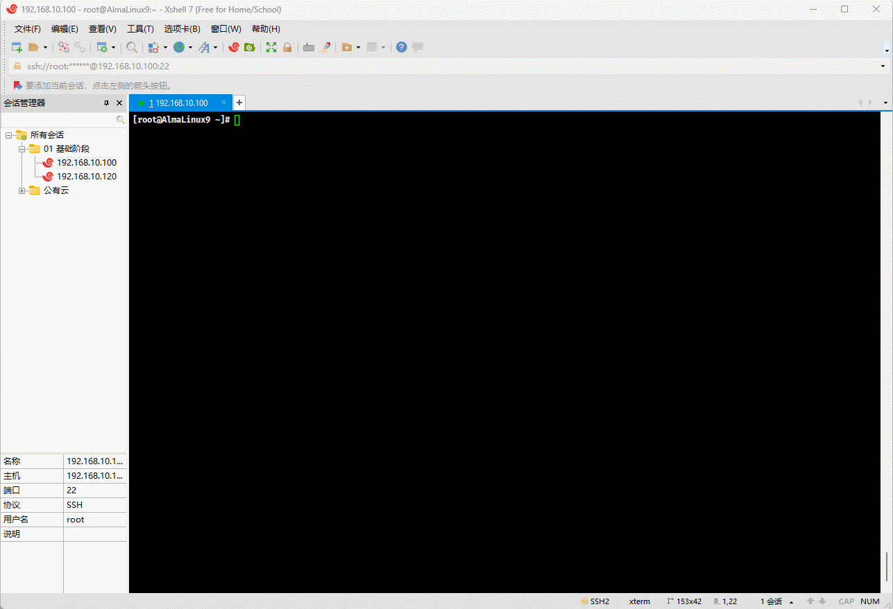
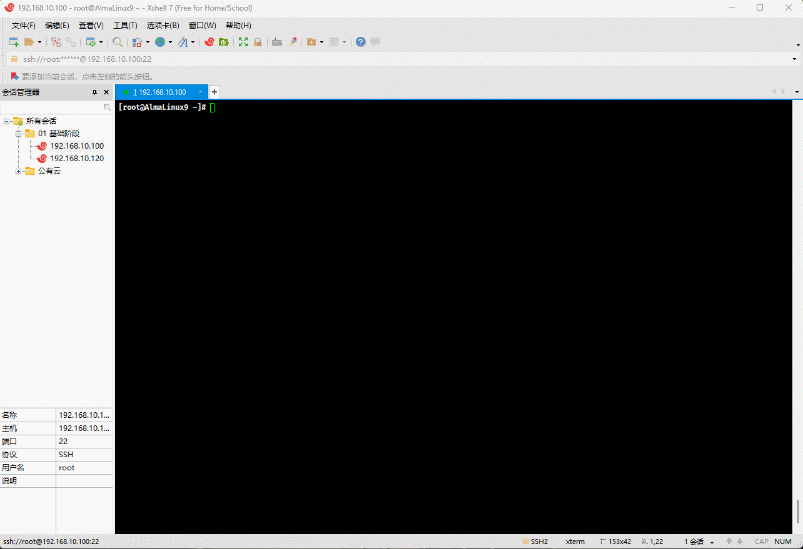
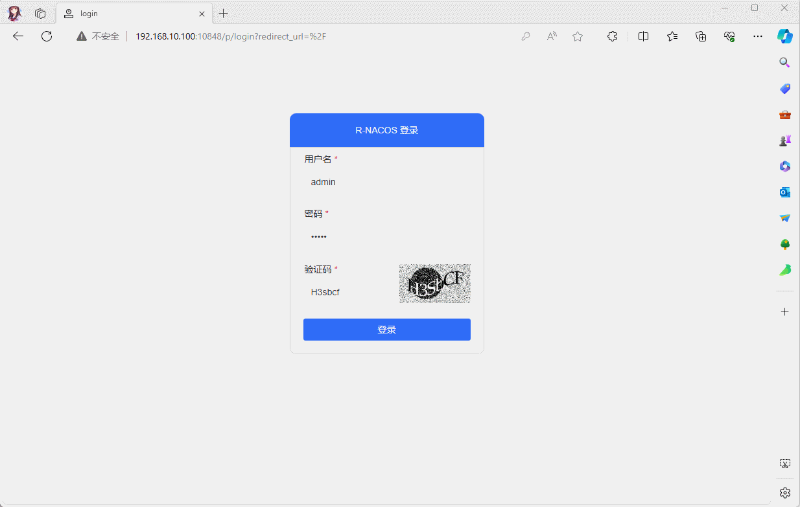
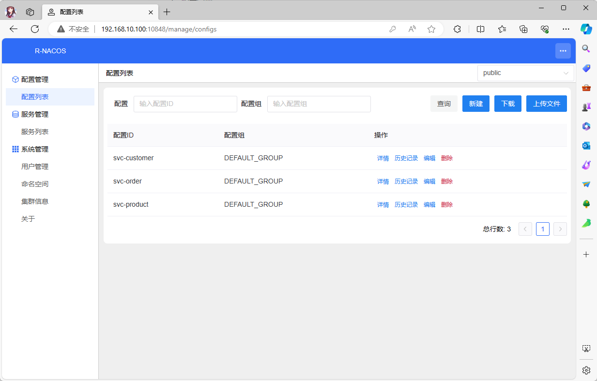

# Chapter 1: Docker Installation and Operation

## 1.1 Preparation

* Check the Linux operating system distribution:

```shell
cat /etc/os-release
```


* Check the kernel version:

```shell
uname -sr
```


* Disable SELinux:

```shell
# Check if SELinux is enabled
getenforce
# Check if SELinux is enabled
cat /etc/selinux/config
# Permanently disable SELinux, requires reboot
sed -i 's/enforcing/disabled/' /etc/selinux/config
# Disable SELinux for the current session, invalid after reboot
setenforce 0
# Check if SELinux is enabled
cat /etc/selinux/config
```



* Disable swap partition:

```shell
# Check if swap partition exists
free -h
# Disable swap for the current session, invalid after reboot
swapoff -a
# Permanently disable swap, requires reboot
sed -ri 's/.*swap.*/#&/' /etc/fstab
# Check if swap partition exists
free -h
```



* Disable firewall:

```shell
systemctl disable --now firewalld
```


## 1.2 Docker Installation

* Add Docker repository:

> [!WARNING]
>
> In some countries, such as China, there may be issues like Docker domain pollution, making the official Docker repository address unavailable. In such cases, please use `
> dnf config-manager --add-repo https://mirrors.aliyun.com/docker-ce/linux/centos/docker-ce.repo`.

```shell
sudo dnf config-manager \
	--add-repo https://download.docker.com/linux/centos/docker-ce.repo
```


* Install Docker:

```shell
sudo dnf -y install docker-ce docker-ce-cli containerd.io docker-compose-plugin
```


* Start Docker:

```shell
sudo systemctl --now enable docker
```


* Check if Docker is installed successfully:

```shell
docker version
```


* Docker image acceleration:

> [!WARNING]
>
> In some countries, such as China, there may be issues like Docker image source addresses being offline or unavailable, making the previously configured Docker image source address unusable. In such cases, please check the corresponding image source address [here](https://status.1panel.top/status/docker) and replace it.

```shell
sudo mkdir -pv /etc/docker
```

```shell {4-11} 
tee /etc/docker/daemon.json <<-'EOF'
{
  "exec-opts": ["native.cgroupdriver=systemd"],	
  "registry-mirrors": [
    "https://du3ia00u.mirror.aliyuncs.com",
    "https://docker.m.daocloud.io",
    "https://hub-mirror.c.163.com",
    "https://mirror.baidubce.com",
    "https://docker.nju.edu.cn",
    "https://docker.mirrors.sjtug.sjtu.edu.cn"
  ],
  "live-restore": true,
  "log-driver":"json-file",
  "log-opts": {"max-size":"500m", "max-file":"3"},
  "max-concurrent-downloads": 10,
  "max-concurrent-uploads": 5,
  "storage-driver": "overlay2"
}
EOF
```

> [!NOTE]
>
> If the Docker image source address in the **shaded** area above becomes invalid, please check [here](https://status.1panel.top/status/docker) and replace it.

```shell
sudo systemctl daemon-reload
```

``` shell
sudo systemctl restart docker
```


## 1.3 Docker Run

* Docker run command:

```shell
docker run -d --name nacos \
	-p 8848:8848 \
	-p 9848:9848 \
	-p 10848:10848 \
	-v /var/nacos/io:/io:rw \
	qingpan/rnacos:stable
```

> [!WARNING]
>
> `stable` is the latest official version number, but you can also specify a particular image version, such as: `qingpan/rnacos:v0.4.0`.


* Docker image version details:

| Docker Image Version | Tag Format          | Example                         | Notes                                                         |
| -------------------- | ------------------- | ------------------------------- | -------------------------------------------------------------- |
| gnu debian package   | `$version`          | qingpan/rnacos:v0.4.0           | Built on debian-slim, larger in size (compressed 36M, unpacked 102M), offers relatively higher performance. |
| musl alpine package  | `$version-alpine`   | qingpan/rnacos:v0.4.0-alpine    | Built on alpine, smaller in size (compressed 11M, unpacked 34M), offers relatively lower performance. |

> [!WARNING]
>
> If you're not concerned about the version, you can use the latest official version as shown below:
>
> * ① Latest gnu official version: `qingpan/rnacos:stable`.
> * ② Latest alpine official version: `qingpan/rnacos:stable-alpine`.
> * ③ Currently, the `stable` image fails to run on MacOS arm systems. You can switch to the `stable-alpine` image for now, and this note will be removed once the arm `stable` image issue is resolved.

## 1.4 Docker Compose Run

* Create the docker-compose.yaml file:

```shell
vim docker-compose.yaml
```

```yaml
version: '3.8'

services:
  nacos:
    image: qingpan/rnacos:stable
    container_name: nacos
    ports:
      - "8848:8848"
      - "9848:9848"
      - "10848:10848"
    volumes:
      - /var/nacos/io:/io:rw
    restart: always
```


* Run:

```shell
docker compose up -d 
```


* Verify if it's running successfully:

```shell
docker ps
```


## 1.5 Using the r-nacos Console

### 1.5.1 Access

* Once the service is up and running, you can access the old console by navigating to `http://192.168.10.100:8848` in your browser:


> [!WARNING]
>
> The `8848` port is associated with the old console, which doesn't require a login and lacks user management features. It might be phased out in the future!!!

* After the service starts, you can access the new console by visiting `http://192.168.10.100:10848` in your browser:


> [!IMPORTANT]
>
> * ① The default username and password are both `admin`.
>
> * ② The `10848` port is linked to the new console, which offers comprehensive user management, login verification, and permission controls, and can be exposed to external networks.

* Now, you can log in and explore:



### 1.5.2 User Management

* Here are the roles available for user management:


> [!IMPORTANT]
>
> Before making the nacos console port accessible externally, it's advisable to create a custom administrator and either delete or disable the default admin user. The default roles are as follows:
>
> * Administrator: Full access to all console features.
> * Developer: Access to all console features except user management.
> * Guest: Limited to querying data from the configuration and registration centers, with no editing rights.

* Feel free to add a few users to test the functionality:


### 1.5.3 Configuration Management

* Managing the configuration list:



* Editing configurations:


### 1.5.4 Service Management

* Managing the service list:


* Managing service instances:


### 1.5.5 Namespace Management

* Namespace list:


# Chapter 2: Software Package Installation

## 2.1 Linux or Mac Installation and Running

### 2.1.1 Overview

* (For Linux or Mac users, simply download the appropriate software package from [github](https://github.com/r-nacos/r-nacos/releases), decompress it, and you're ready to go).

> [!IMPORTANT]
>
> The R-Nacos repository has recently moved, and the new address is [here](https://github.com/nacos-group/r-nacos/).

### 2.1.2 Installation

* Download the package:

```
wget -P /opt \
https://github.com/r-nacos/r-nacos/releases/download/v0.4.3/rnacos-x86_64-unknown-linux-musl.tar.gz
```


* Decompress the package:

```shell
cd /opt
```

```shell
tar -xvf rnacos-x86_64-unknown-linux-musl.tar.gz
```


### 2.1.3 Foreground Running

* Run the following command:

```shell
./rnacos
```


### 2.1.4 Background Running

* To run in the background:

```shell
nohup ./rnacos > rnacos.log 2>&1 &
```


* To check the specified process:

```shell
# 8848 or 10848
netstat -anp | grep 8848
```


## 2.2 Win Installation and Running

* Simply decompress and run rnacos.exe: omitted.