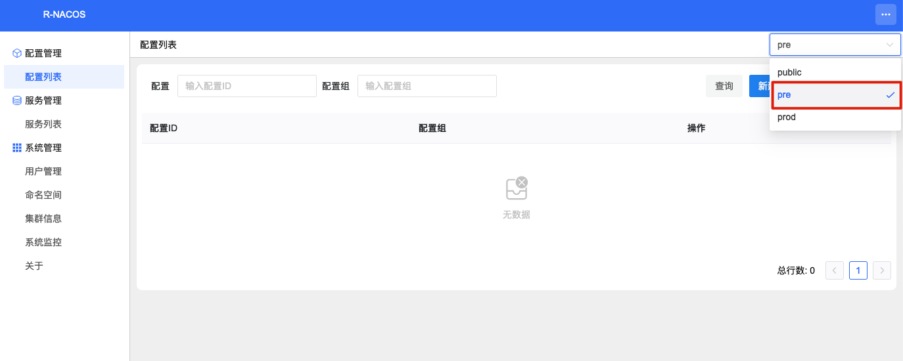
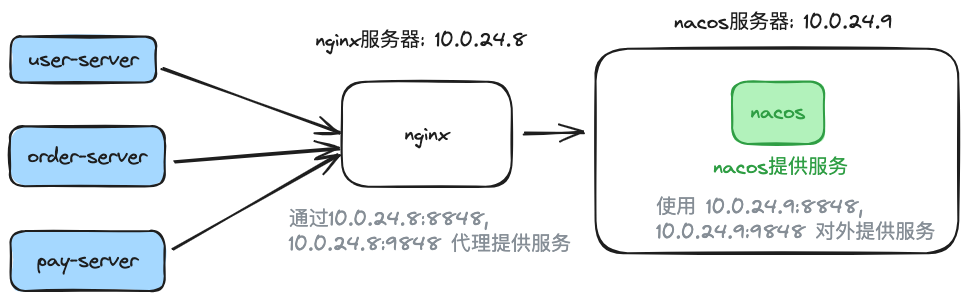
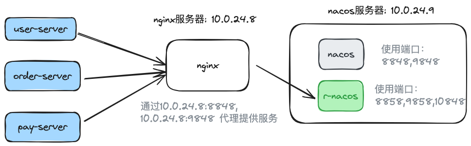

## 1. Introduction

Many students, after discovering the features of r-nacos, initially use it only in development and testing environments.

After some time, some students consider migrating from nacos to r-nacos for production environments as well.

Some students who previously used nacos services plan to switch to r-nacos after learning about it.

So, how can we smoothly migrate from nacos to r-nacos?

> [!NOTE]
>
> [r-nacos](https://github.com/nacos-group/r-nacos) Overview:
>
> * ① r-nacos is a nacos service built in rust. Compared to java nacos, it offers the same features, starts faster, uses fewer system resources (initial memory less than 10 M), performs better, and runs more stably.
>
> * ② r-nacos is designed to be fully compatible with the latest nacos client SDK protocols (including 1.x http OpenApi and 2.x grpc protocol), allowing applications using nacos to migrate seamlessly to r-nacos.

## 2. Migration Plan

### 2.1 Analyzing the Data to Migrate

The migration goal is clear. Before planning the migration, we need to analyze the data to be migrated.


Migrating from nacos to r-nacos mainly involves four types of data:
1. Nacos authentication user data
2. Namespace data
3. Configuration data
4. Service instance data

Nacos user data, namespace data, and configuration data are persistent and need to be set up and migrated beforehand.
Service instance data is dynamic and should automatically register after the switch, so it doesn't need to be migrated in advance.

### 2.2 Migration Phases and Steps

We can break the migration into three phases:
1. Pre-migration preparation;
2. Migration;
3. Post-migration wrap-up;

1. Pre-migration Preparation


1. Deploy r-nacos for data migration and entry before the migration. (If nacos and r-nacos are on the same machine, start r-nacos with a temporary port and update it during migration.)
2. Enter the application-dependent user information in the r-nacos console to initialize user data.
3. Enter namespace data in the r-nacos console;
4. Export data from the nacos console by namespace (each namespace exports a file); then import this configuration data into the corresponding namespace in the r-nacos console to complete the migration.

2. Migration Phase

Once data migration is done, start the traffic migration.


Switch the application request traffic to r-nacos. Different scenarios require different approaches:

> [!NOTE]
>
> * ① For applications directly requesting nacos services: r-nacos must replace nacos on the same machine; shut down nacos first, then change r-nacos's port to the original nacos port and start it to complete the switch.
> * ② For applications requesting nginx and reverse proxying to nacos: update the nginx configuration to point to r-nacos instead of nacos, then reload the configuration to complete the switch.

After the traffic migration, monitor the application and r-nacos to ensure they perform as expected.

> [!CAUTION]
>
> Even if the goal is to enable authentication, do not enable interface authentication (`RNACOS_ENABLE_OPEN_API_AUTH=false`) at this stage to avoid blocking applications using old tokens from nacos.

3. Post-migration Wrap-up


After the migration is stable for a while, you can remove nacos and keep only r-nacos.

If you need to enable interface authentication, follow these steps:
> [!NOTE]
>
> * ① Wait for the old tokens of the applications to expire (default is 5 hours) and have them reacquire new tokens from r-nacos, then enable the interface authentication configuration and restart r-nacos (r-nacos restarts in seconds, with minimal impact on applications).
> * ② Alternatively, restart the applications in batches to force them to use r-nacos tokens, then enable the interface authentication configuration and restart r-nacos.

This completes the migration from nacos to r-nacos.

## 3. Migration Scenarios

The previous section outlined the migration steps, which might have seemed a bit abstract. To provide a clearer understanding, we’ll now present two specific migration scenarios.

### 3.1 Migration Plan for Applications Directly Connected to a Single-Node Nacos

Deployment Diagram:


Nacos Persistence Content:


> [!NOTE]
>
> Nacos Usage:
>
> * ① A single Nacos instance is deployed on 10.0.24.9, using the default ports 8848 and 8948 to provide services.
> * ② Two namespaces, pre and prod, are configured on Nacos to serve the pre-production and production environments, respectively.
> * ③ There are 3 applications, each with 2 instances using Nacos services; in total, there are two environments, with one environment containing 3 configuration files, 3 services, and 6 instances.
> * ④ The application uses the username: `xxx_app_id`, password: `a07a6deb5e56`.

Goal: Deploy r-nacos on the same machine to replace Nacos and provide services, using the [systemd deployment method](https://r-nacos.github.io/docs/notes/deploy_example/linux_systemd_deploy/).

#### 3.1.1 Migration Steps — Pre-Migration

**Step 1**: Deploy r-nacos on 10.0.24.9 using a temporary port 8858.
Here, we assume the deployment is done using the Linux systemd method. Refer to the r-nacos documentation for specific deployment details, which will not be expanded here.
Key configuration items are as follows:

```properties
# r-nacos listens on HTTP port, using temporary port 8858, which will be adjusted later during the switchover
RNACOS_HTTP_PORT=8858
# r-nacos listens on gRPC port, gRPC port is not configured here, default value: HTTP port + 1000
# RNACOS_GRPC_PORT=9858
# r-nacos independent console port, no port conflict, can directly use the formal port
RNACOS_HTTP_CONSOLE_PORT=10848
RNACOS_ENABLE_OPEN_API_AUTH=false
```

Note: If using the Docker startup method, the configuration ports do not need to be changed, only the corresponding external mapped ports need to be modified.

**Step 2**: Initialize user information.
Access `http://10.0.24.9:10848/rnacos/` to enter the console.
Add application-dependent users, username: `xxx_app_id`, password: `a07a6deb5e56`.


**Step 3**: Initialize namespaces.
Initialize namespaces pre and prod.


**Step 4**: Migrate configuration information.

1. Export configurations from Nacos.


Export configurations under the pre and prod namespaces separately.


The exported file name format is: `nacos_config_export_20240721230938.zip`.

Note: Remember to modify the file name to add namespace tags after each export to avoid selecting the wrong file during import.

2. Import configurations into r-nacos.
Import the configuration files exported from Nacos in the previous step into the pre and prod namespaces of r-nacos.

a) Enter the r-nacos console -> Configuration List page, select the corresponding namespace.



b) Upload and import configuration files.


After import:


The above operations are for the pre namespace; repeat the same for the prod namespace, which will not be expanded here.

#### 3.1.2 Migration Steps - During Migration

**Step 5**: Once data initialization is complete, shut down r-nacos. First, update the temporary port to the official port to make it easier to start r-nacos directly later.

Stop the r-nacos service:

```
systemctl stop rnacos
```

Key configuration settings are as follows:

```
properties
# r-nacos http listening port
RNACOS_HTTP_PORT=8848
# r-nacos grpc listening port, not configured here, default value: HTTP port + 1000
# RNACOS_GRPC_PORT=9848
# r-nacos independent console port
RNACOS_HTTP_CONSOLE_PORT=10848
# Disable interface authentication during the switchover
RNACOS_ENABLE_OPEN_API_AUTH=false
```

**Step 6**: Shut down nacos

```sh
# Navigate to the nacos directory and run the following command to shut down nacos
./bin/shutdown.sh
```

**Step 7**: Start r-nacos

The configuration is already set up before shutting down nacos. Start the r-nacos service directly:

```sh
systemctl start rnacos
```

#### 3.1.3 Migration Steps - Post Migration

**Step 8**: After the traffic switch is complete, monitor the application and r-nacos to ensure they are functioning correctly.

Check the application service through the upstream application page to verify its status.
Monitor r-nacos through the monitoring page to confirm it is being accessed by the application.


**Step 9**: Enable r-nacos interface authentication (optional)

Five hours after completing the traffic switch, enable r-nacos interface authentication.

Key configuration settings are as follows:

```
properties
# r-nacos http listening port
RNACOS_HTTP_PORT=8848
# r-nacos grpc listening port, not configured here, default value: HTTP port + 1000
# RNACOS_GRPC_PORT=9848
# r-nacos independent console port
RNACOS_HTTP_CONSOLE_PORT=10848
# Enable interface authentication
RNACOS_ENABLE_OPEN_API_AUTH=true
```

Restart the r-nacos service:

```sh
systemctl start rnacos
```

At this point, the migration from nacos to r-nacos is complete.

### 3.2 Application Service Linking Nacos via Nginx Migration Scenario

Deployment Diagram:



The Nacos setup remains the same as in the previous scenario, with the addition of an Nginx proxy to facilitate service deployment.

To switch the Nacos connection through Nginx, simply update the Nginx configuration by replacing the original Nacos address with the r-nacos address. Then, reload the configuration using `nginx -s reload` to complete the traffic redirection.

#### 3.2.1 Migration Steps - Before Migration

The steps are identical to steps 1, 2, 3, and 4 from the previous scenario, so they won't be detailed here.

#### 3.2.2 Migration Steps - During Migration

**Step 5**: Update the Nginx configuration to replace the original Nacos address with the r-nacos address.

Original Nginx Configuration:

```
http {
    # nacos http, using http reverse proxy
    server {
        listen       8848;
        listen  [::]:8848;
        server_name  localhost;

        location /nacos {
            proxy_pass http://10.0.24.9:8848;
            proxy_set_header Host $proxy_host;
            proxy_set_header  Connection "";
            proxy_http_version  1.1;
        }
    }
}

stream {
    # nacos grpc, using tcp reverse proxy
    server {
        listen       9848;
        proxy_pass http://10.0.24.9:9848;
        proxy_connect_timeout 5s;
        proxy_timeout 20s;
    }
}
```

Updated Nginx Configuration:

```
http {
    # nacos http, using http reverse proxy
    server {
        listen       8848;
        listen  [::]:8848;
        server_name  localhost;

        location /nacos {
            proxy_pass http://10.0.24.9:8858;
            proxy_set_header Host $proxy_host;
            proxy_set_header  Connection "";
            proxy_http_version  1.1;
        }
    }
}

stream {
    # nacos grpc, using tcp reverse proxy
    server {
        listen       9848;
        proxy_pass http://10.0.24.9:9858;
        proxy_connect_timeout 5s;
        proxy_timeout 20s;
    }
}
```

Execute `nginx -s reload` to reload the configuration and finalize the traffic switch.

After switching:



#### 3.2.3 Migration Steps - Post-Migration

The steps are the same as steps 8 and 9 in the previous scenario, so they won't be detailed here.

## Summary

When migrating from Nacos to R-Nacos, analyzing the data items to be migrated and planning the tasks for each phase can help create a suitable migration strategy.

The migration process can be divided into three stages: pre-migration, during migration, and post-migration. This article offers detailed steps based on example scenarios.

If the case above matches your situation, you might want to add an Nginx reverse proxy layer before accessing Nacos, and then follow the migration steps outlined in Case 2.

----

Date: 2024-07-22

Author: [heqingpan](https://github.com/heqingpan)