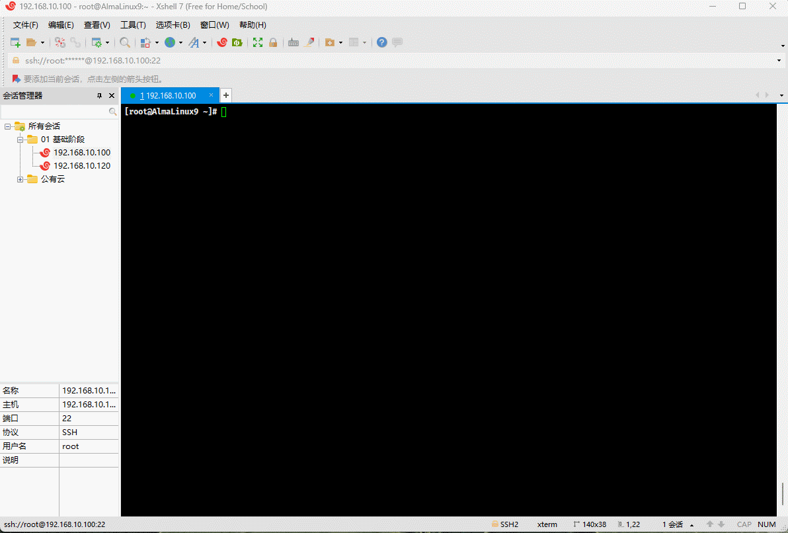
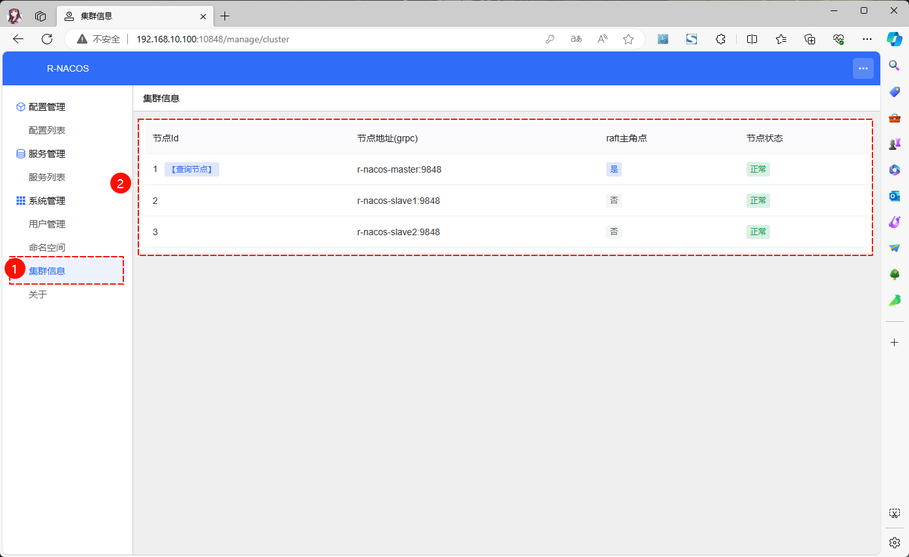

# 第一章：简介

## 1.1 概述

* r-nacos 在 v0.3.0 版本后支持集群部署，集群部署的目标是通过多实例部署的方式，支持服务的水平扩容，支持部分节点异常后继续提供服务，提升稳定性。

## 1.2 配置中心

* 对于`配置中心`而言，r-nacos 采用 raft 集群协议+本地存储，持久化数据，**不需要再依赖 MySQL 存储配置**，其持久化机制类似`etcd`：

| 请求方式 | 说明                                                     | 性能                                          |
| :------- | :------------------------------------------------------- | :-------------------------------------------- |
| 写入     | 只有主节点能写入，其它节点收到写入请求后转发到主节点写入 | 集群 2000 tps 左右，有优化空间。              |
| 读取     | 每个节点都能读取全量数据                                 | 单节点 80 000 qps 左右，集群总容量为 n*8 万。 |

> 温馨提示ℹ️：TPS（Transactions Per Second）和QPS（Queries Per Second）都是衡量系统性能的指标，但它们关注的方面有所不同。
>
> * **TPS（每秒事务数）**：
>   - TPS 指的是服务器在单位时间内（通常是每秒）能够完成的事务数量。
>   - 一个事务通常是指一个完整的操作过程，例如：一个客户机向服务器发送请求并接收响应的整个过程。
>   - TPS 更侧重于整个系统的性能，包括处理能力、响应时间和并发处理能力。
>   - TPS 的高低反映了系统的整体吞吐量，即系统在单位时间内能够处理的工作量。
> * **QPS（每秒查询率）**：
>   - QPS 是指服务器在单位时间内能够响应的查询次数。
>   - QPS 更侧重于数据库或其他存储系统的性能，尤其是在处理读取操作（查询）时的能力。
>   - 对于一个页面的一次访问，可能只形成一个 TPS，但可能会产生多次对服务器的请求，这些请求都可以计入 QPS。
>   - 高 QPS 值表示系统能够快速响应查询请求，并具有较高的读取效率。
>
> 简而言之，TPS 关注的是系统整体处理事务的能力，而 QPS 关注的是系统处理查询请求的效率。在实际应用中，提高 TPS 可能涉及到并发编程、缓存优化、数据库优化和负载均衡等技术手段，而提高 QPS 则更多地关注于数据库查询性能的优化。

## 1.3 注册中心

* 对于`注册中心`而言，r-nacos 采用类 distor 协议，同步集群间的数据；注册中心复用配置中心节点列表信息，两者协议是分别单独实现的。

| 请求方式 | 说明                                                         | 性能                                       |
| :------- | :----------------------------------------------------------- | :----------------------------------------- |
| 写入     | 注册中心每个节点平等，按 hash 划分每个节点负责的内容；节点对负责的服务可写，否则转发到对应负责的节点处理。 | 集群 10 000 tps 左右。                     |
| 读取     | 每个节点都能读取全量数据                                     | 单节点 30 000 qps 左右。集群总容量为 n*3万 |


# 第二章：集群部署

## 2.1 概述

* 集群部署和单机部署类似，只是对应的运行参数不同，增加了集群节点的配置。

## 2.2 集群规则说明

* 集群部署相关的配置参数有 4 个：

| 集群相关的配置参数    | 说明                                                 | 默认值         | 说明                                                         |
| --------------------- | ---------------------------------------------------- | -------------- | ------------------------------------------------------------ |
| RNACOS_RAFT_NODE_ID   | 节点 ID                                              | 1              | 单节点运行时无需配置。                                       |
| RNACOS_RAFT_NODE_ADDR | 节点地址IP:GrpcPort                                  | 127.0.0.1:9848 | 单节点运行时每次启动都会生效；<br>多节点集群部署时，只取加入集群时配置的值。 |
| RNACOS_RAFT_AUTO_INIT | 是否当做主节点初始化(只在每一次启动时生效)           | true           | 节点 1 时默认为 true。<br>节点非 1 时为 false。              |
| RNACOS_RAFT_JOIN_ADDR | 是否作为节点加入对应的主节点（只在第一次启动时生效） | 空             | 127.0.0.1:9848                                               |

> 温馨提示ℹ️：具体参数说明在[这里](../../env_config/)。

* 集群配置规则：
  * ① 所有的`集群节点`都需要设置 `RNACOS_RAFT_NODE_ID` 和 `RNACOS_RAFT_NODE_ADDR`；其中，不同节点的 `node_id` 和 `node_addr` 不能相同，并且 `node_id` 是一个`正整数`，`node_addr` 是 `ip:grpc_port`。
  * ② 对于集群`主`节点，初始设置 `RNACOS_RAFT_AUTO_INIT` 为 `true` （如果节点为 1，默认是 true，不用额外设置）。
  * ③ 对于集群`从`节点， 初始设置 `RNACOS_RAFT_AUTO_INIT` 为 `false` (节点非 1，默认就是 false，不用额外设置)；另外需要设置 `RNACOS_RAFT_JOIN_ADDR` 为当前`主`节点的地址，以方便启动时自动加入集群中。
  * ④ `第 ② 步骤`和 `第 ③步骤` 只是为了初始化组建集群。集群运行起来之后，后继启动配置从 raft db 中加载。
  * ⑤ `集群节点数量不要求`，可以是 1、2、3、4、... ； 不过 raft 协议只支持小于集群半数节点异常后继续提供写入服务(查询不影响)，例如：3 个节点集群支持 1 个节点异常后提供写入服务，2 个节点集群可以正常运行，不支持节点异常后提供服务。
  * ⑥ `从节点可以在使用过程中按需加入`，如：原来 3 个节点，可能在使用一段时间后增加 2 个节点扩容。

## 2.3 集群规划

* 本次使用的是 Docker Compose 的 `bridge` 网络，以避免同台主机端口冲突问题，即：


## 2.4 Docker Compose 运行

* 编写 docker-compose.yaml 文件：

```shell
vim docker-compose.yaml
```

```yaml
version: '3.8' # 指定版本号

services: # 所有需要启动的服务
  r-nacos-master: # 主节点
    image: qingpan/rnacos:stable
    container_name: r-nacos-master
    environment: # 环境变量
      - RUST_LOG=warn
      - RNACOS_HTTP_PORT=8848
      - RNACOS_RAFT_NODE_ADDR=r-nacos-master:9848
      - RNACOS_CONFIG_DB_DIR=db
      - RNACOS_RAFT_NODE_ID=1
      - RNACOS_RAFT_AUTO_INIT=true
      - TZ=Asia/Shanghai
    volumes:
      - /var/nacos/io1:/io:rw
      - /etc/localtime:/etc/localtime:ro
    ports: # 宿主机和容器的端口映射关系
      - "8848:8848" # 左边宿主机端口:右边容器端口
      - "9848:9848" # 左边宿主机端口:右边容器端口
      - "10848:10848" # 左边宿主机端口:右边容器端口
    networks: # 配置容器连接的网络，引用顶级networks下的条目
      - rnacos
    restart: always
  r-nacos-slave1: # 从节点
    image: qingpan/rnacos:stable
    container_name: r-nacos-slave1
    environment: # 环境变量
      - RUST_LOG=warn
      - RNACOS_HTTP_PORT=8848
      - RNACOS_RAFT_NODE_ADDR=r-nacos-slave1:9848
      - RNACOS_CONFIG_DB_DIR=db
      - RNACOS_RAFT_NODE_ID=2
      - RNACOS_RAFT_JOIN_ADDR=r-nacos-master:9848
      - TZ=Asia/Shanghai
    volumes:
      - /var/nacos/io2:/io:rw
      - /etc/localtime:/etc/localtime:ro  
    networks: 
      - rnacos
    restart: always
    depends_on:
      - r-nacos-master
  r-nacos-slave2: # 从节点
    image: qingpan/rnacos:stable
    container_name: r-nacos-slave2
    environment: # 环境变量
      - RUST_LOG=warn
      - RNACOS_HTTP_PORT=8848
      - RNACOS_RAFT_NODE_ADDR=r-nacos-slave2:9848
      - RNACOS_CONFIG_DB_DIR=db
      - RNACOS_RAFT_NODE_ID=3
      - RNACOS_RAFT_JOIN_ADDR=r-nacos-master:9848
      - TZ=Asia/Shanghai
    volumes:
      - /var/nacos/io3:/io:rw
      - /etc/localtime:/etc/localtime:ro  
    networks: 
      - rnacos
    restart: always
    depends_on:
      - r-nacos-master 
      - r-nacos-slave1
# 定义网络，可以多个，如果不声明，默认会创建一个网络名称为“工程名称_default”的bridge网络
networks:
  rnacos: # 一个具体网络的条目名称
    name: rnacos # 网络名称，默认为“工程名称_网络条目名称”
    driver: bridge # 网络模式，默认为bridge
```


* 运行 Docker Compose ：

```shell
docker compose up -d
```



* 查看是否运行成功：

```shell
docker compose ps
```


* 通过浏览器（地址是`http://192.168.10.100:10848/`）访问：



## 2.5 不使用 Docker 部署

### 2.5.1 概述

* 部署方式和[软件包单机部署](../linux_deploy/)类似，只不过 r-nacos 支持通过环境变量启动或通过配置文件方式启动，对应的文档在[这里]()。

### 2.5.2 集群规划

* 使用三台 Linux 主机作为 r-nacos 的节点，即：


* 假设三台 Linux 主机的配置信息如下：

| Linux 主机     | IP 地址        | 说明   |
| -------------- | -------------- | ------ |
| r-nacos-master | 192.168.10.100 | 主节点 |
| r-nacos-slave1 | 192.168.10.101 | 从节点 |
| r-nacos-slave2 | 192.168.10.102 | 从节点 |

> 注意⚠️：需要保证三台 Linux 主机能互相通信，测试环境中，可以选择关闭防火墙！！！

### 2.5.3 集群部署

#### 2.5.3.1 各个节点的配置信息

* `r-nacos-master` 的 `env01` 配置文件的信息如下：

```env
#file:env01 , Initialize with the leader node role
RUST_LOG=warn
RNACOS_HTTP_PORT=8848
RNACOS_RAFT_NODE_ADDR=127.0.0.1:9848
RNACOS_CONFIG_DB_DIR=db01
RNACOS_RAFT_NODE_ID=1
RNACOS_RAFT_AUTO_INIT=true
```

* `r-nacos-slave1` 的 `env02` 配置文件的信息如下：

```env
#file:env02 , Initialize with the follower node role
RUST_LOG=warn
RNACOS_HTTP_PORT=8849
RNACOS_RAFT_NODE_ADDR=127.0.0.1:9849
RNACOS_CONFIG_DB_DIR=db02
RNACOS_RAFT_NODE_ID=2
RNACOS_RAFT_JOIN_ADDR=127.0.0.1:9848
```

* `r-nacos-slave2` 的 `env03` 配置文件的信息如下：

```shell
#file:env03 , Initialize with the follower node role
RUST_LOG=warn
RNACOS_HTTP_PORT=8850
RNACOS_RAFT_NODE_ADDR=127.0.0.1:9850
RNACOS_CONFIG_DB_DIR=db03
RNACOS_RAFT_NODE_ID=3
RNACOS_RAFT_JOIN_ADDR=127.0.0.1:9848
```

#### 2.5.3.2 启动集群

* 依次启动各个节点，需要先启动主节点：

```shell
nohup ./rnacos -e env01 > rnacos.log 2>&1 &
```

* 再启动从节点，让其加入到集群中：

```shell
nohup ./rnacos -e env02 > rnacos.log 2>&1 &
```

```shell
nohup ./rnacos -e env03 > rnacos.log 2>&1 &
```

## 2.6 集群重启

### 2.6.1 概述

* 如果是 Docker Compose 搭建的集群，重新启动非常方便，选择下面的任意一条命令即可：

```shell
# 该命令会移除容器，再启动容器；如果没有进行挂载，将会丢失数据。
docker compose down && docker compose up -d
```

```shell
# 停止并重新启动所有服务，但不会移除容器
docker compose restart
```

* 如果是软件包搭建的集群，重新启动和第一次启动的方式一样：略。

### 2.6.2 说明

* 集群启动后，集群的节点信息已久化节点本地数据库中。 在节点重启时后直接从本地数据库加载集群节点的信息。这时就不需要读取需要加入的集群地址，`RNACOS_RAFT_JOIN_ADDR` 不会再被使用(留在配置中也不影响)。
* 部分节点重启，在重启一个心跳时间（`0.5s`）就会被重新加入集群。
* 全部节点重启， raft 需要启动静默 `5s` + 选举超时 `3s` 后才重新选举主节点；`10s` 左右集群才提供配置写入服务。 期间配置查询，和注册中心的读写可以正常使用。