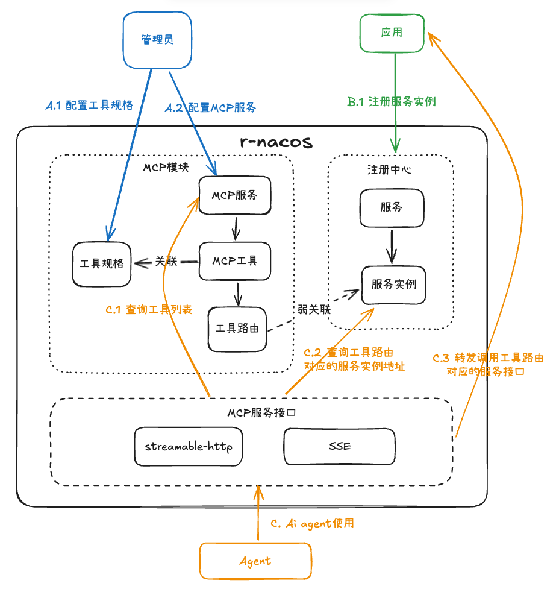
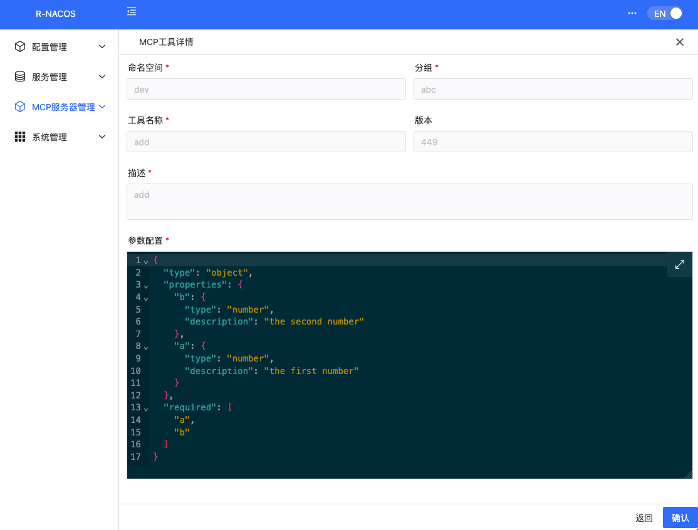
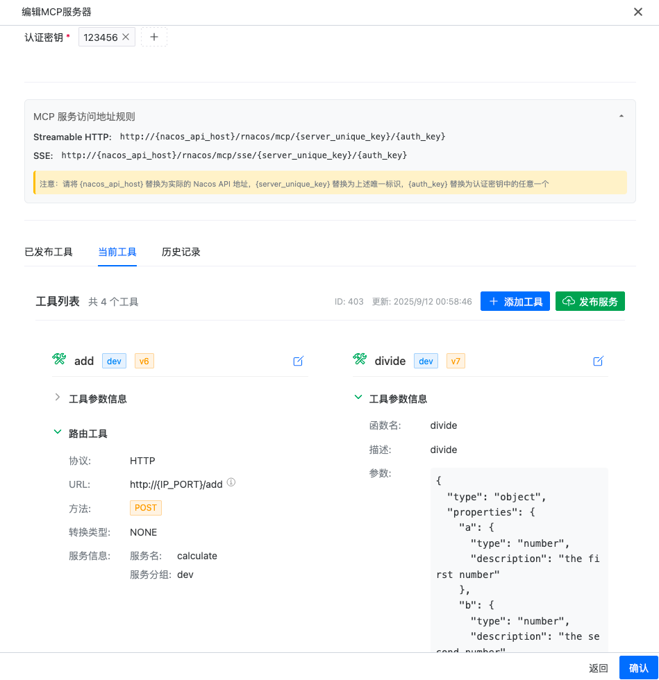
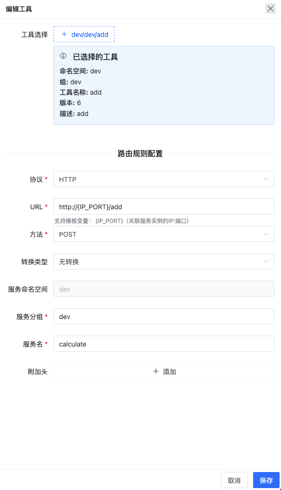
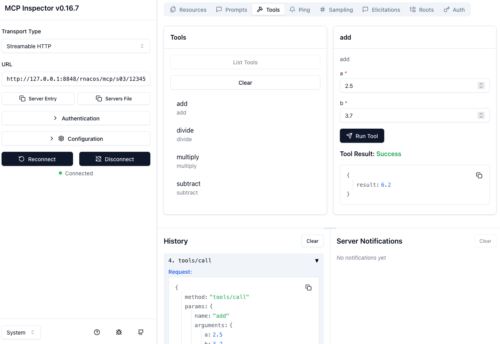

# r-nacos支持mcp

r-nacos支持mcp，内置mcp server与接口转发；支持让注册到r-nacos的普通http接口通过r-nacos直接转化成mcp服务对外提供服务。


## 适用场景

如果你有一个或多个普通应用之前已经接入nacos/r-nacos注册中心，想提供mcp服务给ai code agent或自定义agent使用。使用r-nacos不用修改应用代码，只需要在控制台配置对应的mcp服务，即可对外提供mcp服务。

如果应用已经使用mcp sdk提供服务的应用，但它因状态问题只支持单实例使用。你想要支持集群部署，也可能考虑使用r-nacos。

如果之前没有注册到r-naocs，也可以考虑先把应用注册到r-nacos再使用r-nacos中间件服务。
r-naocs兼容nacos协议，支持多种不多语言的nacos sdk，接入很方便。

## 功能说明

1. 支持在控制台页面管理mcp工具与服务；mcp服务支持版本管理，发布的版本与编辑的版本可独立维护，历史版本可快速恢复。
2. mcp服务同时支持mcp sse协议与mcp streamable-http协议（推荐使用）；
3. 内置mcp服务，支持mcp调用转发，支持多种http参数调用：原json参数调用、json转化为form参数调用，json转化为url参数调用；
4. mcp转发高性能：单机压测streamable-http，其qps 可达29350 ；（sse有状态，暂时没有合适的工具压测；理论上多一些集群内部转发信息处理，大概也能超过1.5万）
5. 支持集群调用，即支持同一个session多次请求打到不同的r-nacos节点;r-nacos内部通过现有的集群通信能力支持把请求路由到对应的节点处理。

## 架构




## 使用说明

### 1. 部署运行r-nacos

使用支持mcp服务的 v0.7.x版本，具体的请参考 [r-nacos部署说明文档](https://r-nacos.github.io/docs/quick_started/)

### 2. 创建MCP工具规格

工具规格定义就是提供给大模型的工具描述。
这部分与具体的实现无关，即同一个工具规格，可以有不同的具体实现。
同时一个工具可以被多个MCP服务关联，这也是单独管理MCP工具规格的主要原因。

给大模型(openai)单个工具样例如下：

```json
{
    "type": "function",
    "function": {
        "name": "add",
        "description": "add",
        "parameters": {
            "type": "object",
            "properties": {
                "a": {
                    "type": "number",
                    "description": "the first number"
                },
                "b": {
                    "type": "number",
                    "description": "the second number"
                }
            },
            "required": [
                "a",
                "b"
            ]
        }
    }
}
```

其中除掉具体格式主要内容有3个字段`name`,`description`,`parameters` 。
外加上r-nacos管理需要的分组命名空间、分组信息，r-nacos中一个工具规格有5个字段。

详情页如下：



### 3. 创建MCP服务

一个mcp服务可有关联一组同命名空间的工具。
为了支持工具调用每个工具除了规格还需要配置对应的调用路由信息。

MCP服务信息如下：




编辑单个工具窗口：




### 注册工具对应的服务到r-nacos

上面的工具路由对应的服务可参考项目自带的测试工程 [python calculate-api](https://github.com/nacos-group/r-nacos/tree/master/sdk-examples/python/calculate_api) 或 [rust calculate-api](https://github.com/nacos-group/r-nacos/tree/master/sdk-examples/rust/calculate-api)

注：调用工具前，需要把路由对应的应用启动并注册到r-nacos中
### 服务使用

创建好服务后，使用以下mcp地址即可对外提供服务。

```
Streamable HTTP:
http://{nacos_api_host}/rnacos/mcp/{server_unique_key}/{auth_key}
SSE:
http://{nacos_api_host}/rnacos/mcp/sse/{server_unique_key}/{auth_key} 
```

样例：

```
Streamable:  http://127.0.0.1:8848/rnacos/mcp/calculate/123456
SSE:  http://127.0.0.1:8848/rnacos/mcp/sse/calculate/123456
```


### 验证使用方式

可用官方工具，在终端运行`npx @modelcontextprotocol/inspector`，然后在浏览器中查看、调用验证工具。



也可以在其它如claude code，roo code ,opencode或自定义等agent中配置mcp使用。